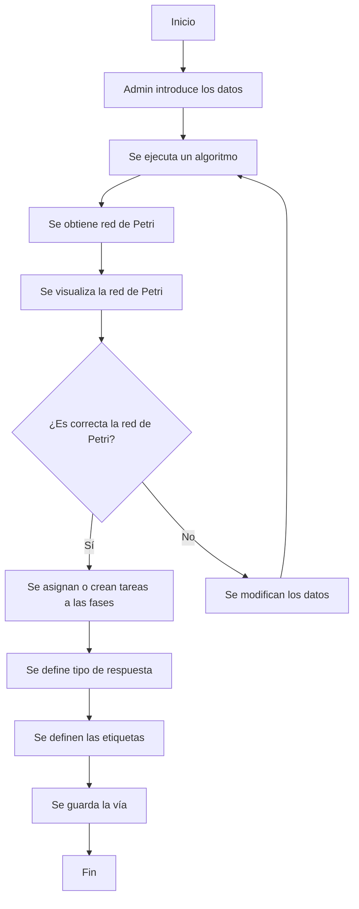
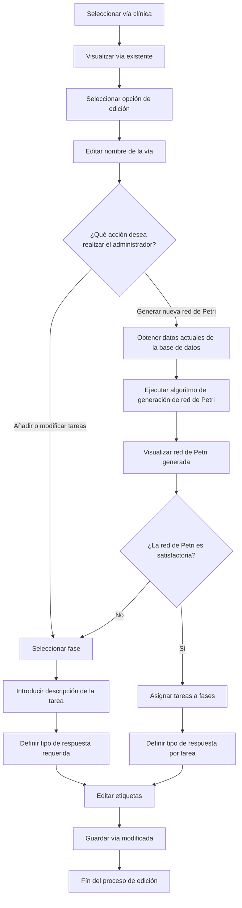

# Requisitos
En este documento se recogen los nuevos requisitos que se añaden al sistema existente.
### Diccionario de términos
-  **Paciente**, persona que va a ser sometida a una operación de la cual se guarda su número de historia clínica, nombre, apellidos, edad, sexo y opcionalmente el indice de masa corporal en el momento de la operación.
- **Operación**, procedimiento médico que se realiza sobre un paciente para tratar una condición médica.
-  **Vía clínica**, conjunto estructurado y estandarizado de prácticas y procedimientos que se deben seguir para la realización de una operación. Se compone de una secuencia de acciones que deben llevar acabo los médicos durante el ciclo completo de una operación, desde la planificación de la operación hasta el post-operatorio.
-  **Tareas**, acciones que realizan los médico para llevar acabo una vía clínica.
### Stakeholders
- **Médicos**, son aquellos que van a hacer uso del sistema registrando los procedimientos realizados durante la vía clínica.
- **Administrador**, se encarga de gestionar los usuarios y el acceso de estos a las distintas vías de los pacientes. Se encarga de gestionar las vías clínicas. Además es el único con acceso a todos los datos del sistema mediante la exportación de estos.
### Requisitos funcionales
#### Requisitos funcionales de los médicos

**RFM1.** El sistema debe permitir seleccionar la vía clínica al crear una operación nueva.
**RFM2.** El sistema debe mostrar la vía correspondiente a la operación
**RFM3.** El sistema deber permitir marcar como completadas las tareas de una operación asociada a una via.
#### Requisitos funcionales del administrador

**RFA1.** El sistema debe permitir visualizar el listado de todas las vías clínicas registradas.
**RFA2.** El sistema debe permitir seleccionar una vía clínica específica para consultar su contenido o editarla.
**RFA3.** El sistema debe mostrar el detalle completo de una vía clínica seleccionada, incluyendo sus fases y tareas.
**RFA4.** El sistema debe permitir exportar los datos recopilados de una vía clínica seleccionada, incluyendo únicamente las tareas marcadas como realizadas en operaciones anteriores vinculadas a dicha vía.
**RFA5.** El sistema debe permitir al administrador iniciar el proceso de creación de una nueva vía clínica mediante la introducción del nombre.
**RFA6.** Tras la introducción de los datos, el sistema debe ejecutar un algoritmo que genere automáticamente un modelo de red de Petri representando el flujo de la vía clínica.
**RFA7.** El sistema debe mostrar de forma visual la red de Petri generada para su evaluación por parte del administrador.
**RFA8.** El sistema debe permitir al administrador aceptar o rechazar la red de Petri generada:
* **RFA8.1.** En caso de rechazo, el administrador podrá modificar los datos y volver a ejecutar el algoritmo.
* **RFA8.2.** En caso de aceptación, se continuará con la asignación de tareas.
**RFA9.** El sistema debe permitir la asignación de tareas específicas a cada fase de la vía clínica.
**RFA10.** El sistema debe permitir añadir nuevas tareas de manera manual.
**RFA11.** El sistema debe permitir definir el tipo de respuesta requerida para cada tarea: dicotómicas, opción múltiple o valor numérico.
**RFA12.** El sistema debe permitir añadir etiquetas a una vía clínica para identificar las operaciones posteriores.
**RFA13** Una vez completadas y validadas todas las etapas, el sistema debe guardar la vía clínica y los datos asociados en la base de datos para su posterior utilización.
**RFA14.** El sistema debe permitir al administrador modificar una vía clínica previamente registrada.
**RFA15.** Las modificaciones posibles deben incluir:
* **RFA15.1.** Edición del nombre y descripción de la vía.
* **RFA15.2.** Gestión de tareas existentes (editar, eliminar o añadir).
* **RFA15.3.** Generación de una nueva red de Petri basada en los datos actuales de la vía clínica, recopilados a partir de operaciones reales asociadas a la vía.

### Requisitos no funcionales

**RNF1** Los datos exportados deben ser en formato `csv`

## Diagramas
### Diagrama de actividades: Proceso de crear una nueva vía 

### Diagrama de actividades: Proceso de editar una vía existente (Editar)

