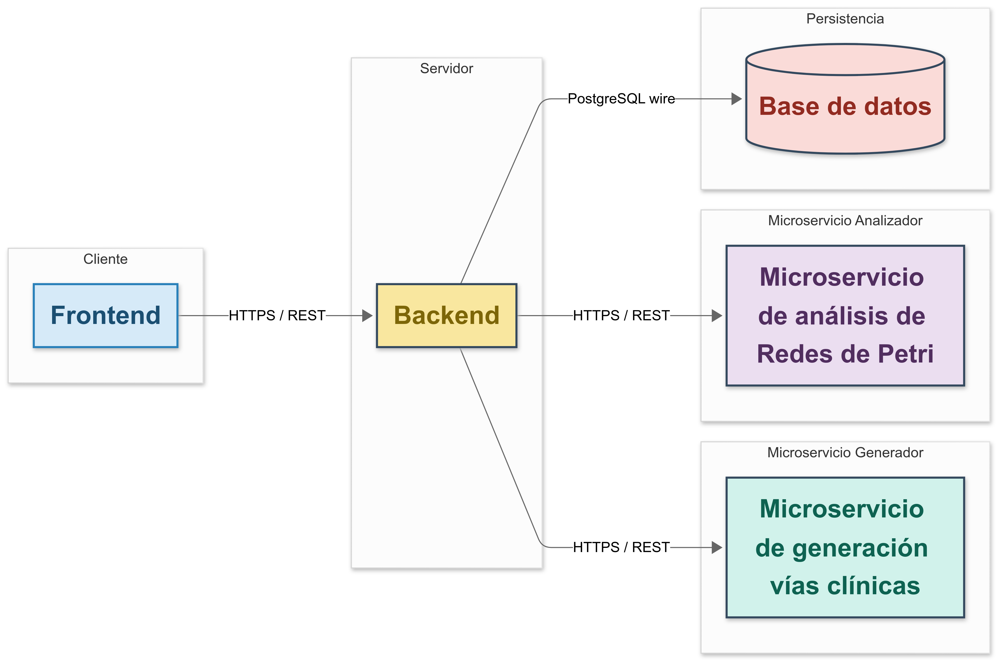

# Clinical Pathway Optimizer

**Design and Implementation of a Web System for Clinical Pathway Optimization Using Formal Methods**
**Bachelor's Thesis – Computer Engineering Degree – University of Zaragoza**
Author: **Miguel Aréjula Aísa**
In collaboration with: **Hospital Clínico Universitario Lozano Blesa**

---

## Overview

This project is a web-based system designed to help healthcare professionals:

* Digitize and structure **clinical pathways**.
* Monitor pathway compliance in real-time.
* Continuously improve clinical processes using **formal analysis techniques**.

The system integrates an existing **process mining algorithm** into an accessible web interface, removing technical barriers and enabling real-world clinical use.

---

## Clinical Motivation

In many hospitals, clinical protocols are still managed manually or with loosely structured tools like spreadsheets. This creates challenges such as:

* Poor tracking of patient treatments.
* Lack of objective evaluation of protocol adherence.
* Difficulty in optimizing procedures using actual clinical data.

This project addresses these issues in the context of a research initiative between the **University of Zaragoza** and the **Hospital Clínico Universitario Lozano Blesa**.

---

## Key Features

### Doctors

* Register and view patients and surgeries.
* Log tasks performed during treatments.
* Search patients by medical record number.

### Admin-doctors

* Import new clinical pathways from CSV files.
* Run an algorithm to generate Petri nets.
* Visually validate generated models.
* Edit existing pathways and manage users.

---

## System Architecture



### Tech Stack

| Component       | Technology                          |
| --------------- | ----------------------------------- |
| Frontend        | React, Tailwind CSS                 |
| Backend         | Node.js, Express                    |
| Microservices   | Python, FastAPI                     |
| Formal Analysis | LoLA (Low-Level Petri Net Analyzer) |
| Database        | PostgreSQL                          |

---

## Local Setup

### Requirements
* Docker 

### Execution Steps
1. **Clone the repository**:
   ```bash
   git clone https://github.com/Arejula11/TFG.git
   ````
2. **Execute the docker-compose file**:
   ```bash
   cd TFG
   docker compose up -d
   ```
3. **Open browser** and navigate to `http://localhost:80` to access the frontend.

> Configure `.env` files to manage credentials and API routes.

---

##  Formal Validation

The system uses **LoLA** to automatically validate generated Petri nets, ensuring they are:

* **Deadlock-free**
* **Live**, meaning they always allow clinical progress

The analyzer microservice communicates with LoLA through the command line, wrapped in a FastAPI service.
Docker is supported for easier deployment.

---

## Video demos

### 1. Creating a new clinical pathway
 
[](https://youtu.be/cKY8HHUGJA0)
<br>
[Watch: Monitoring a clinical pathway (YouTube)](https://youtu.be/tO_TtbWCWCs)
### 2. Monitoring a clinical pathway
[](https://youtu.be/tO_TtbWCWCs)
<br>
[Watch: Monitoring a clinical pathway (YouTube)](https://youtu.be/tO_TtbWCWCs)

---

## Key Learnings

* Selecting a suitable **formal analysis tool** (LoLA over Renew/TimeNet).
* The value of clear documentation and iterative development.
* Importance of **early database modeling** validation.
* Integrating undocumented third-party code and adapting it.

---

## Acknowledgments

Special thanks to the **medical staff at Hospital Clínico Lozano Blesa**, and to the academic supervisors from the **Department of Computer Science and Systems Engineering** at the **University of Zaragoza**.

---
